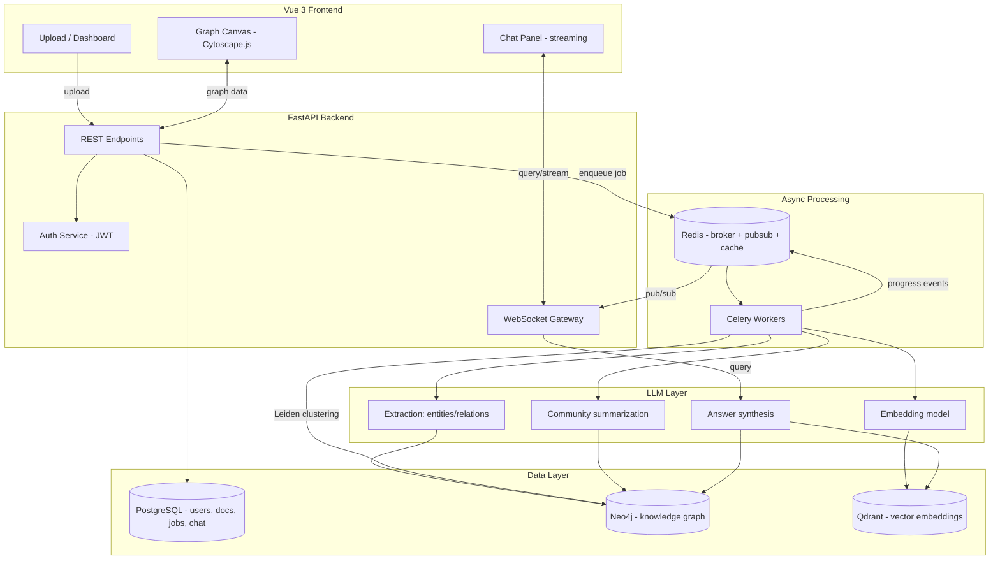

# GraphRAG Explorer — Full System Design Document

**Stack:** Vue 3 (frontend) · FastAPI (backend) · Neo4j (graph) · PostgreSQL (relational) · Qdrant (vectors) · Redis + Celery (async) · LLM API (OpenAI/Anthropic, swappable)

---

## 1. Project Overview

Untangle ingests unstructured documents — research papers, academic books, and textbooks — extracts entities and relationships into a knowledge graph, clusters the graph into hierarchical communities with LLM-generated summaries, and answers natural-language questions using a hybrid retrieval strategy that combines graph traversal (multi-hop reasoning, community-level synthesis) with dense vector retrieval (semantic chunk search). The frontend lets a user upload a source, watch ingestion happen in real time, explore the resulting knowledge graph visually as an interactive isometric map, and converse with it through Regulus, an AI guide — with the exact subgraph used to answer each question highlighted live on the map.

Untangle supports two distinct modes:

**Research Mode (Papers):** Ingests academic papers (PDF, arXiv link). Extracts named entities (people, organisations, concepts, locations) and their relationships. Clusters them into thematic communities. The knowledge map renders entities as towers, relationships as roads between them, and communities as named districts. Cross-paper linking: if a concept requires context outside the current paper's scope, Untangle auto-suggests semantically related papers from the user's library; users can also manually import an additional paper to extend the map.

**Study Mode (Books):** Ingests textbooks and study books (PDF, EPUB, TXT). Extracts the structural hierarchy of the material — chapters become districts, sections/topics become towers, sub-topics become sub-towers. Key concepts are linked by roads where conceptual relationships exist. If a topic references something outside the book's scope, Untangle flags it and auto-suggests external sources; the user can also manually import any additional book or paper to extend the map at any time.

Both modes share the same isometric canvas engine. The AI guide Regulus adjusts its conversational framing based on mode — citation and methodology focus in Research Mode; concept explanation and exam-preparation focus in Study Mode.

To structure knowledge acquisition, both modes support **Path-Based Learning Traversal** — laying a sequential curriculum trail (foundational prerequisite concepts → intermediate mechanisms → advanced synthesis) over the network with an interactive step-by-step HUD. Furthermore, each building provides a **Deep Topic Reader** allowing students and researchers to read all compiled source chunks, definitions, and formulas related to that concept in one comprehensive reading pane.

This is a from-scratch reimplementation of the core ideas in Microsoft Research's GraphRAG paper (Edge et al., 2024), extended to support structured academic material beyond unstructured research papers.

### Why this is a strong signal project
- Combines graph algorithms (community detection, hierarchical clustering, topological dependency sorting), NLP (entity/relation extraction, structural hierarchy extraction), IR (hybrid retrieval), and full-stack engineering (real-time UI, async pipelines).
- The dual-mode design (papers vs. books) demonstrates product thinking — the same technical infrastructure adapted to two meaningfully different user journeys.
- Path-based learning traversal transforms abstract graph networks into structured curricula for exam preparation and systematic research study.
- Produces a natural, quantifiable comparison: GraphRAG vs. plain vector-RAG on multi-hop questions — your best resume bullet.
- Every layer (extraction quality, dedup quality, retrieval quality, answer faithfulness) has a metric you can report.

---

## 2. Goals & Non-Goals

**Goals**
- Ingest PDF/TXT/DOCX/EPUB documents in either Research Mode (papers) or Study Mode (books/textbooks) and build a queryable, interactive knowledge graph automatically.
- Research Mode: extract entities and relationships, cluster into communities, enable multi-hop reasoning across the graph.
- Study Mode: extract structural hierarchy (chapter → section → topic → sub-topic), link concepts by relationship, support cross-source extension at any time.
- Support both local search (specific, entity/concept-centred questions) and global search (broad, thematic questions using community summaries) — the two retrieval modes from the GraphRAG paper.
- Real-time ingestion progress and streaming chat answers via Regulus, the AI guide.
- Visual knowledge map exploration with the retrieved subgraph highlighted per answer, on a shared isometric canvas for both modes.
- **Path-Based Learning Traversal**: extract concept dependency order and provide an illuminated sequential learning path with next/prev navigation.
- **Deep Topic Reader**: compile all source chunks, mathematical formulas, and relational context for any selected tower into an in-depth reading dossier.
- **Exam Gist & High-Yield Revision Sheet**: elaborate, rapid-review synthesis of the most critical topics across the source (core formulas, definitions, and likely exam questions) designed for time-constrained exam study.
- Auto-suggestion of related sources when a concept requires outside context (both modes), plus manual source import at any time (both modes).
- A reproducible evaluation harness comparing GraphRAG vs. vector-only RAG.

**Non-goals (cut for v1, list as "future work")**
- Multi-tenant billing/teams — single-user auth is enough.
- Real-time collaborative graph editing.
- Support for image/table-heavy PDFs (OCR pipeline) — plain text extraction is enough for v1.
- Training your own extraction model — LLM-based extraction is the pragmatic choice.

---

## 3. High-Level Architecture



### Request-time flow (a single question)
1. User asks a question in the chat panel → sent over WebSocket.
2. Backend embeds the query, does a vector search in Qdrant to find "seed" entities/chunks.
3. Backend expands N hops from seed entities in Neo4j (local search) and/or pulls relevant community summaries (global search) depending on query classification.
4. Backend assembles a context window from graph facts + raw chunk text.
5. LLM synthesizes an answer with inline citations, streamed token-by-token back over the WebSocket.
6. The subgraph actually used is sent alongside the answer so the frontend can highlight it on the canvas.

---

## 4. Tech Stack Summary

| Layer | Choice | Why |
|---|---|---|
| Frontend framework | Vue 3 + Composition API + TypeScript | TS catches API-shape mismatches early |
| Build tool | Vite | Fast dev server, standard for Vue 3 |
| State management | Pinia | Official Vue store, simpler than Vuex |
| Styling | Tailwind CSS | Fast to build clean UI without a design system |
| Design framework | Tailwind CSS + custom design tokens | Custom tokens for district colors, game shadows, glassmorphism utilities extend Tailwind for the gamified design system |
| Fonts | Inter (interface) + JetBrains Mono (technical labels) | Two-font system: Inter for all UI text, JetBrains Mono for code labels, edge relations, and telemetry data |
| Icons | Material Symbols Outlined (variable weight/fill) | Supports weight and fill axis variations, good icon coverage for both game and utility contexts |
| Graph visualization | Custom SVG isometric town canvas + Cytoscape.js (headless, for layout computation) | The gamified 2.5D town metaphor requires custom SVG rendering; Cytoscape.js is retained headless for force-directed layout computation that feeds isometric grid placement |
| Charts (eval dashboard) | Chart.js or ApexCharts | Simple, good Vue wrapper support |
| Backend framework | FastAPI | Async-native, automatic OpenAPI docs, Pydantic validation — better fit than Flask for this workload (WebSockets + async I/O to 3 databases) |
| ASGI server | Uvicorn (+ Gunicorn worker manager in prod) | Standard FastAPI deployment |
| Task queue | Celery + Redis broker | Mature, handles multi-step ingestion pipelines with retries |
| Relational DB | PostgreSQL | Users, documents, job status, chat history |
| Graph DB | Neo4j (Community Edition or AuraDB Free) | Native graph queries (Cypher), has built-in Graph Data Science library for Leiden/Louvain community detection |
| Vector DB | Qdrant | Fast, easy self-host via Docker, good filtering support |
| Cache / pub-sub | Redis | Doubles as Celery broker, WebSocket progress relay, and query cache |
| LLM provider | Anthropic Claude (Haiku for extraction, Sonnet for synthesis) or OpenAI equivalents | Abstract behind an interface — swappable, keeps cost down by tiering model choice per task |
| Embeddings | OpenAI `text-embedding-3-small` or open-source `bge-small-en-v1.5` via `sentence-transformers` | Open-source option removes per-call cost for large corpora |
| Document parsing | `unstructured` library (or `pypdf`/`python-docx` directly) | Handles PDF/DOCX/TXT uniformly |
| NLP preprocessing | spaCy (sentence segmentation), optional `fastcoref` for coreference resolution | Improves entity dedup quality before LLM extraction |
| Auth | Clerk (clerk-backend-api SDK) | Handles session tokens, OAuth, MFA, JWKS rotation — team is integrating Clerk on the backend; frontend uses @clerk/vue |
| Containerization | Docker + Docker Compose | One-command local spin-up of all 5 services |
| Deployment | Backend+Celery: Railway/Render · Frontend: Vercel/Netlify · Neo4j: AuraDB free tier · Postgres: Supabase/Railway · Redis: Upstash · Qdrant: Qdrant Cloud free tier | All have generous free tiers, no server management |
| CI/CD | GitHub Actions | Lint + test on PR, build/push images, auto-deploy on merge |
| Monitoring | Structured logging (`structlog`) + Sentry (free tier) | Enough for a portfolio project; mention Prometheus/Grafana as a stretch goal |

> **Flask vs FastAPI note:** I'd steer you to FastAPI here specifically because this app is I/O-bound across three databases plus streaming WebSocket responses — FastAPI's native `async`/`await` avoids threading workarounds Flask would need. If you have existing Flask familiarity and want to use it anyway, the design still works with Flask-SocketIO instead of native WebSockets and Flask's synchronous view functions calling the same Celery tasks — just note it in your README as a deliberate trade-off you made and why.

---

## 5. Data Model

### 5.1 Neo4j Graph Schema

**Node labels**

```
(:Document {id, title, filename, uploaded_at, status, source_mode})
(:Chunk {id, text, chunk_index, document_id, embedding_id})
(:Entity {id, name, type, description, embedding_id, mention_count, path_order})
(:Community {id, level, title, summary, entity_count})
```

**Relationship types**

```
(:Document)-[:HAS_CHUNK]->(:Chunk)
(:Chunk)-[:MENTIONS]->(:Entity)
(:Entity)-[:RELATES_TO {relation_type, description, weight, source_chunk_id}]->(:Entity)
(:Entity)-[:BELONGS_TO]->(:Community)
(:Community)-[:PARENT_OF]->(:Community)   // hierarchical community structure
(:Entity)-[:PREREQUISITE_FOR]->(:Entity)  // concept dependency
(:Entity)-[:NEXT_IN_PATH {order: int}]->(:Entity) // sequential curriculum path
```

#### Study Mode — Structural Hierarchy Nodes

When `Document.source_mode = 'study'`, the ingestion pipeline extracts a structural hierarchy instead of named entities:

```
(:Chapter {id, title, chapter_number, document_id, summary, path_order})
(:Section {id, title, section_number, chapter_id, summary, path_order})
(:Topic {id, name, description, section_id, depth_level, embedding_id, path_order})
(:SubTopic {id, name, description, parent_topic_id, embedding_id, path_order})
```

Additional relationship types for Study Mode:

```
(:Document)-[:HAS_CHAPTER]->(:Chapter)
(:Chapter)-[:HAS_SECTION]->(:Section)
(:Section)-[:HAS_TOPIC]->(:Topic)
(:Topic)-[:HAS_SUBTOPIC]->(:SubTopic)
(:Topic)-[:CONCEPTUALLY_LINKS]->(:Topic)   // same or cross-book conceptual relationship
(:Topic)-[:PREREQUISITE_FOR]->(:Topic)     // learning dependency
(:Topic)-[:NEXT_IN_PATH {order: int}]->(:Topic) // sequential learning journey
(:Topic)-[:NEEDS_CONTEXT {reason: str, auto_suggested: bool}]->(:Topic)  // cross-source context link
(:Document)-[:LINKED_SOURCE {link_reason: str, mode: 'auto'|'manual'}]->(:Document)
```

Cross-mode rule: A Study Mode document can link to a Research Mode document via `LINKED_SOURCE` when a book topic auto-suggests or manually imports a paper for deeper context, and vice versa.

#### 5.1.1 Topic Dossier Data Structure (Deep Reader)

When a user clicks "Read Everything Related to This Topic", the backend compiles a comprehensive topic dossier:

```json
{
  "node_id": "top-1-1-1",
  "name": "Fork System Call",
  "type": "TOPIC",
  "path_step": 1,
  "summary": "Creates a child process that is an almost exact clone of the caller.",
  "key_formulas_or_code": [
    "pid_t rc = fork();\nif (rc < 0) { /* error */ }\nelse if (rc == 0) { /* child */ }\nelse { /* parent */ }"
  ],
  "raw_chunks": [
    {
      "chunk_id": "chunk-14",
      "section_ref": "OSTEP §5.1",
      "text": "The fork() system call is used in Unix systems to create a new process..."
    }
  ],
  "prerequisites": ["Process Concept"],
  "next_concepts": ["Exec System Call", "Wait System Call"]
}
```

**Example Cypher — writing an extracted triple (idempotent via MERGE):**

```cypher
MERGE (e1:Entity {name: $source_name})
  ON CREATE SET e1.id = randomUUID(), e1.type = $source_type, e1.description = $source_desc
MERGE (e2:Entity {name: $target_name})
  ON CREATE SET e2.id = randomUUID(), e2.type = $target_type, e2.description = $target_desc
MERGE (e1)-[r:RELATES_TO {relation_type: $relation}]->(e2)
  ON CREATE SET r.description = $rel_desc, r.source_chunk_id = $chunk_id, r.weight = 1
  ON MATCH SET r.weight = r.weight + 1
```

**Example Cypher — local search (N-hop expansion from seed entities):**

```cypher
MATCH (seed:Entity)
WHERE seed.id IN $seed_entity_ids
CALL apoc.path.subgraphAll(seed, {maxLevel: 2, relationshipFilter: "RELATES_TO"})
YIELD nodes, relationships
RETURN nodes, relationships
```

**Community detection (using Neo4j Graph Data Science library):**

```cypher
CALL gds.graph.project('entityGraph', 'Entity', 'RELATES_TO')
CALL gds.leiden.write('entityGraph', {
  writeProperty: 'communityId',
  includeIntermediateCommunities: true
})
```

### 5.2 PostgreSQL Schema

```sql
CREATE TABLE users (
    id UUID PRIMARY KEY DEFAULT gen_random_uuid(),
    email TEXT UNIQUE NOT NULL,
    hashed_password TEXT NOT NULL,
    created_at TIMESTAMPTZ DEFAULT now()
);

CREATE TABLE documents (
    id UUID PRIMARY KEY DEFAULT gen_random_uuid(),
    user_id UUID REFERENCES users(id),
    filename TEXT NOT NULL,
    status TEXT NOT NULL DEFAULT 'pending', -- pending|parsing|extracting|clustering|ready|failed
    uploaded_at TIMESTAMPTZ DEFAULT now(),
    processed_at TIMESTAMPTZ,
    neo4j_document_id TEXT,
    error_message TEXT
);

-- Mode column determines which ingestion pipeline and canvas semantics to use
ALTER TABLE documents ADD COLUMN source_mode TEXT NOT NULL DEFAULT 'research';  -- 'research' | 'study'
ALTER TABLE documents ADD COLUMN display_title TEXT;  -- user-editable friendly name for the map

-- Cross-source links between documents (both modes)
CREATE TABLE document_links (
    id UUID PRIMARY KEY DEFAULT gen_random_uuid(),
    source_document_id UUID NOT NULL REFERENCES documents(id) ON DELETE CASCADE,
    target_document_id UUID NOT NULL REFERENCES documents(id) ON DELETE CASCADE,
    link_reason TEXT,                         -- why this link was created
    link_mode TEXT DEFAULT 'manual',          -- 'auto' (AI suggested) | 'manual' (user imported)
    created_at TIMESTAMPTZ DEFAULT now()
);

CREATE TABLE jobs (
    id UUID PRIMARY KEY DEFAULT gen_random_uuid(),
    document_id UUID REFERENCES documents(id),
    job_type TEXT NOT NULL,   -- parse|extract|embed|cluster|summarize
    status TEXT NOT NULL DEFAULT 'queued',
    progress INT DEFAULT 0,   -- 0-100
    created_at TIMESTAMPTZ DEFAULT now(),
    updated_at TIMESTAMPTZ DEFAULT now()
);

CREATE TABLE chat_sessions (
    id UUID PRIMARY KEY DEFAULT gen_random_uuid(),
    user_id UUID REFERENCES users(id),
    document_id UUID REFERENCES documents(id),
    created_at TIMESTAMPTZ DEFAULT now()
);

CREATE TABLE chat_messages (
    id UUID PRIMARY KEY DEFAULT gen_random_uuid(),
    session_id UUID REFERENCES chat_sessions(id),
    role TEXT NOT NULL,  -- user|assistant
    content TEXT NOT NULL,
    retrieved_subgraph JSONB,  -- node/edge ids used for this answer, for frontend highlighting
    search_mode TEXT,          -- local|global
    latency_ms INT,
    created_at TIMESTAMPTZ DEFAULT now()
);

-- Gamification: player profile & progression
CREATE TABLE player_profiles (
    user_id UUID PRIMARY KEY REFERENCES users(id),
    display_name TEXT NOT NULL DEFAULT 'Scholar',
    level INT NOT NULL DEFAULT 1,
    xp INT NOT NULL DEFAULT 0,
    xp_to_next_level INT NOT NULL DEFAULT 100,
    sparks INT NOT NULL DEFAULT 0,       -- citation gems earned
    energy INT NOT NULL DEFAULT 100,     -- daily action budget
    energy_max INT NOT NULL DEFAULT 100,
    avatar_initials TEXT DEFAULT 'SC',
    updated_at TIMESTAMPTZ DEFAULT now()
);

-- Gamification: quest/achievement tracking
CREATE TABLE quests (
    id UUID PRIMARY KEY DEFAULT gen_random_uuid(),
    user_id UUID REFERENCES users(id),
    document_id UUID REFERENCES documents(id),
    quest_type TEXT NOT NULL,  -- 'ingestion' | 'exploration' | 'daily'
    title TEXT NOT NULL,
    description TEXT,
    current_step INT DEFAULT 0,
    total_steps INT DEFAULT 3,
    status TEXT DEFAULT 'active',  -- active | completed | expired
    created_at TIMESTAMPTZ DEFAULT now()
);

-- Each document gets a 'realm' identity for the gamified UI
ALTER TABLE documents ADD COLUMN realm_name TEXT;
ALTER TABLE documents ADD COLUMN realm_emoji TEXT DEFAULT '🏛️';
ALTER TABLE documents ADD COLUMN realm_color TEXT DEFAULT 'emerald';
ALTER TABLE documents ADD COLUMN realm_level INT DEFAULT 1;
```

### 5.3 Qdrant Collections

- `chunks` — vector per text chunk, payload: `{document_id, chunk_id, text_preview}`
- `entities` — vector per entity description, payload: `{entity_id, name, type}`

---

## 6. Ingestion Pipeline (detailed)

Triggered on upload, runs as a Celery task chain:

1. **Validate & store** — check file type/size, save to object storage (or local disk for a portfolio-scale demo), create `documents` row (`status=pending`).
2. **Parse** — extract raw text via `unstructured` (handles PDF/DOCX/TXT uniformly). Update `status=parsing`.
3. **Chunk** — split into ~500–800 token windows with ~15% overlap (LangChain `RecursiveCharacterTextSplitter` or a hand-rolled sentence-aware splitter). Write `Chunk` nodes + `HAS_CHUNK` edges to Neo4j.
4. **Extract (per chunk, parallel Celery subtasks)** — LLM call with structured JSON output:
   ```json
   {
     "entities": [{"name": "...", "type": "PERSON|ORG|CONCEPT|...", "description": "..."}],
     "relationships": [{"source": "...", "target": "...", "relation": "...", "description": "..."}]
   }
   ```
   Use a cheap/fast model here (e.g., Claude Haiku) — this is called once per chunk, so cost adds up fastest at this step.
5. **Entity resolution / deduplication** — the hardest and most research-worthy step:
   - Exact name match (case-insensitive) → auto-merge.
   - Embedding cosine similarity between entity descriptions above a threshold (e.g., 0.88) → candidate merge.
   - Borderline cases (similarity 0.75–0.88) → batch into one LLM disambiguation call: "are 'Obama' and 'the President' in this context the same entity?"
   - Merge via Neo4j `apoc.refactor.mergeNodes`.
6. **Write to Neo4j** — `MERGE` entities and `RELATES_TO` edges (see Cypher above), linked back to source `Chunk` for citation.
7. **Embed** — generate embeddings for each chunk and each (deduplicated) entity description, upsert into Qdrant.
8. **Community detection** — run Leiden clustering (Neo4j GDS) over the entity graph, producing hierarchical `Community` nodes.
9. **Community summarization** — for each community, gather member entities + their relationships, LLM-summarize into a short paragraph ("this cluster concerns X's role in Y"). Store as `Community.summary`.
10. **Finalize** — set `documents.status = ready`, `processed_at = now()`.

Progress at each step is published to a Redis channel (`progress:{document_id}`) and relayed to the frontend via WebSocket for a live progress bar.

---

## 7. Query-Time Retrieval Pipeline (the "GraphRAG" core)

This is the part that differentiates this project from a standard RAG app — implement both retrieval modes from the original paper:

### 7.1 Query classification
A lightweight LLM call (or simple heuristic) classifies the question as:
- **Local** — specific, entity-anchored ("What role did X play in Y?")
- **Global** — broad, thematic ("What are the main themes in this document?")

### 7.2 Local search
1. Embed query → vector search in Qdrant (`entities` collection) → top-k seed entities.
2. Expand 1–2 hops from seeds in Neo4j (`apoc.path.subgraphAll`).
3. Also vector-search `chunks` collection for directly relevant raw text (hybrid retrieval).
4. Assemble context: entity descriptions + relationship descriptions + raw chunk excerpts.
5. LLM synthesizes an answer, citing chunk/document sources.

### 7.3 Global search (map-reduce over communities)
1. Retrieve all (or top-k relevant, via embedding similarity on `Community.summary`) community summaries at the appropriate hierarchy level.
2. **Map step**: for each community summary, LLM generates a partial answer + relevance score to the question (parallelizable).
3. **Reduce step**: LLM combines the highest-scoring partial answers into a final synthesized answer.

### 7.4 Response payload
```json
{
  "answer": "...",
  "citations": [{"document_id": "...", "chunk_id": "..."}],
  "subgraph": {"node_ids": [...], "edge_ids": [...]},
  "search_mode": "local",
  "latency_ms": 842
}
```
The `subgraph` field is what lets the frontend animate/highlight exactly the nodes and edges used — this is your best demo moment in an interview.

---

## 8. Backend API Design (FastAPI)

| Method | Endpoint | Purpose |
|---|---|---|
| POST | `/auth/register` | Create account |
| POST | `/auth/login` | Returns JWT / Clerk session |
| POST | `/documents/upload` | Multipart upload, creates `Document`, enqueues ingestion job, returns `job_id` |
| GET | `/documents` | List current user's documents + status |
| GET | `/documents/{id}` | Document detail + processing metadata |
| GET | `/documents/{id}/mode` | Returns the `source_mode` ('research' or 'study') and top-level structural metadata for the document |
| GET | `/graph/{document_id}/study-map` | Study Mode: returns the chapter→section→topic→subtopic hierarchy as a flat building list and road list for the canvas |
| GET | `/graph/{document_id}/town` | Research Mode: returns entities as buildings with types and positions; relationships as roads |
| GET | `/graph/{document_id}/learning-path` | Returns ordered list of node IDs representing the recommended sequential curriculum / learning journey |
| GET | `/graph/{document_id}/nodes/{id}/dossier` | Returns complete compiled reading dossier for a node (synthesis, key formulas, all raw chunks, prerequisites) |
| GET | `/graph/{document_id}/exam-gist` | Returns document-wide high-yield revision sheet (top high-yield topics, core formulas, definitions to memorize, exam traps) |
| GET | `/documents/{id}/suggest-sources` | AI-powered suggestion of related documents (from user's library + semantic search) that could provide outside context for this document |
| POST | `/documents/{id}/link-source` | Links an external source document to this document (both auto-suggest accept and manual import) |
| DELETE | `/documents/{id}/link-source/{link_id}` | Removes a previously created cross-source link |
| DELETE | `/documents/{id}` | Remove document + cascade-delete graph nodes/vectors |
| WS | `/ws/documents/{id}/progress` | Live ingestion progress events |
| GET | `/graph/{document_id}` | Paginated graph data (nodes/edges) for canvas rendering |
| GET | `/graph/{document_id}/communities` | Community list + summaries, for the sidebar browser |
| POST | `/chat/sessions` | Create a chat session scoped to a document |
| GET | `/chat/sessions/{id}/messages` | Message history |
| WS | `/ws/chat/{session_id}` | Send question, receive streamed tokens + final subgraph payload |
| GET | `/eval/report` | Returns latest evaluation run results (see §11) |

All endpoints (except auth) require `Authorization: Bearer <jwt>`.

---

## 9. Async Processing Detail

- **Broker**: Redis. **Worker**: Celery, run as a separate container/process (`celery -A app.worker worker --loglevel=info`).
- Ingestion is modeled as a **Celery chain**: `parse.s() | chunk.s() | extract.s() | dedupe.s() | embed.s() | cluster.s() | summarize.s()`, each updating the `jobs` table and publishing a Redis pub/sub event.
- Per-chunk extraction (step 4 in §6) is a **Celery group** (fan-out) so chunks are processed in parallel, then a **chord callback** proceeds to deduplication once all chunks finish.
- FastAPI's WebSocket endpoint subscribes to the Redis channel for a given `document_id` and forwards events to the connected client — this decouples the long-running worker process from the web process cleanly.

**Simpler alternative (if you want to cut setup time):** skip Celery entirely and use FastAPI `BackgroundTasks` + polling (`GET /documents/{id}` every 2s from the frontend) instead of WebSocket push. This removes the Redis pub/sub complexity at the cost of a less impressive real-time demo — a reasonable trade-off if you're tight on time, and worth noting explicitly in your README as a scoping decision.

---

## 10. Frontend Architecture (Vue 3)

```text
src/
├── assets/
│   └── town/                    (SVG building sprites, terrain tile templates)
├── stores/           (Pinia)
│   ├── auth.ts
│   ├── documents.ts             (catalog, upload, active document state)
│   ├── chat.ts                  (Regulus conversation, streaming, citations)
│   └── graph.ts                 (nodes, roads, districts, learning path, highlighted subgraph)
├── views/
│   ├── LoginView.vue
│   ├── RegisterView.vue
│   ├── HomeView.vue             (smooth, lively dashboard with dual upload & library grid)
│   └── TownExplorerView.vue     (isometric town canvas + HUDs + reader)
├── components/
│   ├── home/
│   │   ├── TopHudHeader.vue          (header: brand, Clerk user session)
│   │   ├── SourceUploadPanel.vue     (dual-mode upload: left = Research Paper, right = Study Book)
│   │   ├── IngestionProgress.vue     (shows real-time ingestion progress, mode-aware step labels)
│   │   ├── MapCard.vue               (knowledge map card: title, mode badge, stats ribbon, Open Map button)
│   │   └── FilterChips.vue           (category filter badges: All, Research Papers, Study Books)
│   ├── town/
│   │   ├── TownCanvas.vue            (SVG isometric map with pan/zoom/select, path trail)
│   │   ├── TowerBuilding.vue         (2.5D building sprite: crystal spires, modern blocks, arenas, citadels — no flags)
│   │   ├── EnergyRoad.vue            (animated relationship edge beam with particle streams)
│   │   ├── DistrictTurf.vue          (community cluster / chapter colored polygon zone)
│   │   └── TreeCluster.vue           (decorative foliage circles)
│   ├── hud/
│   │   ├── TownNavBar.vue            (top HUD: map title, mode badge, type filters, zoom controls, Exam Gist trigger)
│   │   ├── LearningPathStepper.vue   (NEW: Guided Journey stepper — Step X of N: Next/Prev navigation)
│   │   ├── BuildingInfoCard.vue      (right sidebar: entity detail with stats & "Read Dossier" button)
│   │   ├── TopicReaderModal.vue      (NEW: deep reader drawer displaying exam takeaways, all text chunks, formulas & synthesis)
│   │   ├── ExamGistModal.vue         (NEW: document-wide high-yield revision sheet & rapid exam gist cheat sheet)
│   │   └── RegulusPanel.vue          (AI guide Regulus: mode-aware, streaming answers, citations, source suggestions)
│   └── shared/
│       ├── ModeBadge.vue             (reusable pill badge for Research and Study modes)
│       └── StatCounter.vue           (monospace stat counter box)
└── composables/
    ├── useWebSocket.ts
    ├── useTownLayout.ts              (graph data → isometric spiral building coordinates)
    ├── usePanZoom.ts                 (mouse drag + scroll zoom for SVG canvas)
    └── useGraphHighlight.ts          (dims/highlights SVG building groups upon AI answer)
```

**Key UX detail worth building well:** when an answer streams in through the Regulus panel, the `subgraph` payload triggers `TownCanvas` to dim all non-relevant buildings to 25% opacity with a grayscale wash, while the buildings and roads actually used in the answer pulse with a soft radial glow. The `EnergyRoad` components along the traversal path animate with marching particle effects using SVG `stroke-dasharray`. This single interaction — the map lighting up as Regulus answers — is what makes the demo memorable.

**Town rendering at scale:** for towns with more entities than can comfortably render (~500+ buildings), show only the top-N entities by mention count as prominent towers, with remaining entities represented as small base-level buildings. Community districts act as natural visual clusters. Users can 'zoom into' a district to see its full building inventory, or click a building to expand its 1-hop neighborhood as newly placed adjacent structures.

---

## 11. Evaluation Plan

This section is what turns "cool demo" into a project you can defend rigorously in an interview.

1. **Build a small gold test set**: manually write 20–30 question/answer pairs against one or two ingested documents, including some genuinely multi-hop questions that require traversing 2+ relationships.
2. **Baseline**: implement a plain vector-RAG path (embed query → top-k chunk retrieval → LLM answer, no graph) as a comparison arm — this is maybe half a day of extra work since the embedding infra already exists.
3. **Metrics to report**:
   - **Answer accuracy** against gold answers (LLM-as-judge scoring, 1–5 scale).
   - **Faithfulness**: does the answer's content actually appear in the retrieved context? (RAGAS-style check, or a simple LLM-judge prompt.)
   - **Multi-hop accuracy specifically** — split your test set into single-hop vs. multi-hop questions and report accuracy separately; this is where GraphRAG should clearly beat vector-only RAG, and is your headline number.
   - **Latency**: p50/p95 end-to-end query time, local vs. global search.
   - **Cost per document ingested** and **cost per query**.
4. Store results as a versioned JSON/markdown report in the repo (`/eval/results_v1.md`) so you can show improvement over iterations — this is a very research-flavored artifact that reads well alongside your other academic work.

---

## 12. Deployment

**Local development** — single command:
```yaml
# docker-compose.yml (services)
frontend:    # nginx serving Vite build, port 5173
backend:     # uvicorn FastAPI app, port 8000
celery-worker:
redis:
postgres:
neo4j:       # ports 7474 (browser), 7687 (bolt)
qdrant:      # port 6333
```

**Production (all free-tier friendly):**
- Neo4j → AuraDB Free (managed, no ops burden)
- PostgreSQL → Supabase or Railway
- Redis → Upstash (serverless-friendly free tier)
- Qdrant → Qdrant Cloud free tier
- Backend + Celery worker → Railway or Render (two services from one repo)
- Frontend → Vercel or Netlify (static Vite build, API calls to backend's public URL)
> **Frontend rendering note:** The isometric town canvas is entirely SVG + CSS-based with no WebGL or canvas 2D dependency, keeping the static Vite build simple and compatible with all deployment targets. No GPU requirements on the client.

**CI/CD (GitHub Actions):**
- On PR: lint (`ruff`, `eslint`), run backend unit tests (`pytest`), run frontend type-check (`vue-tsc`).
- On merge to `main`: build Docker images, push to registry, trigger Railway/Render redeploy via webhook, trigger Vercel deploy.

---

## 13. Security Considerations

- JWT auth on all non-public endpoints; short-lived access tokens + refresh token flow.
- File upload validation: type allowlist, size cap, virus-scan stretch goal (ClamAV container) if you want to go the extra mile.
- Rate-limit the `/chat` and `/documents/upload` endpoints (e.g., `slowapi` for FastAPI) — also protects your LLM API budget.
- Sanitize any user-supplied text before it's interpolated into Cypher queries — always use parameterized Cypher (as shown above), never string-concatenate.
- Scope all Neo4j/Postgres/Qdrant queries by `user_id`/`document_id` to prevent cross-user data leakage.

---

## 14. Cost Control

- Use a cheap/fast model (Claude Haiku or GPT-4o-mini) for the high-volume extraction step (§6.4) — this is called once per chunk and dominates ingestion cost.
- Reserve the stronger model (Claude Sonnet or GPT-4o) only for final answer synthesis, which is called once per user question.
- Use an open-source embedding model (`bge-small-en-v1.5` via `sentence-transformers`, runs locally/CPU) instead of a paid embeddings API if you're processing many documents — removes embedding cost entirely at a small quality trade-off.
- Cache repeated queries in Redis (hash the question + document_id) to avoid re-paying for identical questions during demos.

---

## 15. Suggested Build Order (part-time pace)

| Week | Focus |
|---|---|
| 1 | Postgres schema, auth, file upload endpoint, basic parsing + chunking |
| 2 | LLM extraction pipeline (single chunk → structured JSON), write to Neo4j |
| 3 | Entity dedup logic, batch extraction across all chunks (Celery group) |
| 4 | Embeddings → Qdrant, community detection (Leiden via Neo4j GDS), community summarization |
| 5 | Query pipeline: local search + global search, `/chat` WebSocket endpoint |
| 6 | Vue frontend: upload flow, dashboard, static graph canvas rendering |
| 7 | Chat panel with streaming + subgraph highlight animation, real-time ingestion progress |
| 8 | Deploy full stack, build evaluation harness + baseline comparison, write README + demo video |

Realistic total: **6–8 weeks part-time**. If you need to compress this, cut in this order: skip global search first (local search alone is still impressive), then skip Celery in favor of BackgroundTasks + polling, then skip the open-source embedding model in favor of a paid API (less setup).

---

## 16. Draft Resume Bullets (fill in your actual numbers once built)

- *Designed and built GraphRAG Explorer, a full-stack knowledge-graph RAG system (Vue 3, FastAPI, Neo4j, Qdrant) implementing hierarchical community detection (Leiden) and hybrid local/global retrieval, improving multi-hop QA accuracy by __% over a vector-only RAG baseline.*
- *Built an automated entity-resolution pipeline combining embedding similarity and LLM disambiguation, reducing duplicate entity nodes by __% across ingested documents.*
- *Implemented real-time ingestion pipelines with Celery/Redis and WebSocket progress streaming, processing multi-page documents end-to-end in under __ seconds.*
- *Built an evaluation harness (faithfulness, multi-hop accuracy, latency p95) comparing three retrieval strategies, documented in a reproducible report.*

---

## 17. Stretch Goals (once the core is solid)

- Incremental re-ingestion (update the graph when a document changes, without a full rebuild).
- Multi-document cross-referencing (entities that appear across documents get merged into a shared graph).
- Swap in a second LLM provider and A/B the extraction quality — nice second data point for your evaluation report.
- Add a "why did you say that" trace view showing the exact Cypher queries and retrieved chunks for full explainability.
